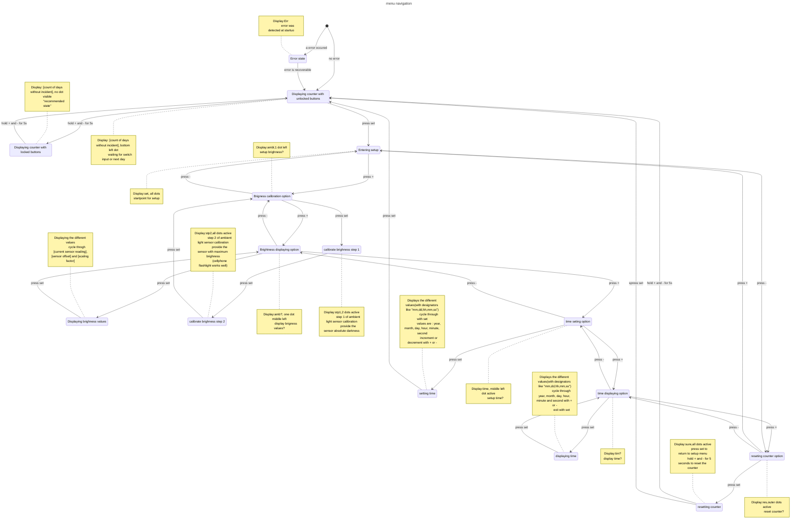

# Velociraptor incident display

This project is a PCB that contains a display which tells you the days since the last velociraptor incident. 
If you want to reproduce this project, check the releases and follow the instructions. 

Thanks to my anonymous "servo skull" for making this render for me.

# overview

The main microcontroller is a Atmega328P(B). Both variants can be used (verified). The microcontroller talks via $I^2C$ to a DS1307Z+ RTC. That way it can be powered down and still remember how many days passed. The counted days are displayed via 74HC595D on 4 7-segment displays. The displays also change their brightness according to the ambient light level. Having 4 digits means the display can count up to 27 years until an upgrade is needed. That is unlikely due to the typical frequency of velociraptor incidents. The PCB can be powered by multiple sources (not at once). Option 1 is the barrel jack. A buck converter is in series with that and can take a Voltage of up to 18V. The second option is the micro-USB. The micro-USB socket is only for power. You cannot program the microcontroller with it. If you don't want to deal with the other 2 options, you can use the pads on the PCB directly (the FTDI header J4 is optimal for that). The downside is that you no longer are protected by the fuse. 3 switches are located on the back and can be used to calibrate the ambient light sensor, read the sensor values, set the time, read the time and reset the counter. The whole software was programmed with C++ on platformIO with the arduino framework. I use the [RTC](https://github.com/Makuna/Rtc "Link to the library") library made by [Michael Miller](https://github.com/Makuna "Makuna").

# build your own

If you want to build your own, please take the time and read all the instructions first. It requires medium soldering skills but is not that difficult.

## sourcing

I do not sell any kits or anything. You have to source all the components yourself.

### PCB

I ordered my PCB from JLCPCB. The PCBs are designed to follow their specification. In the case that the provided gerber export does not work with your PCB house, the packed kicad project is in the hardware folder. If you want to solder it by hand, I recommend a stencil and solder paste. It is much easier and looks nicer, but it is not needed (I did everything with an iron and a hot air station but a iron is sufficient). 

### components

In the following list are the used components. I recommend the use of the Ibom.html for tracking. It makes keeping track of the already sourced components much easier. Not all components on the PCB have to be populated because I used some for testing. In the following list only the ones you need are mentioned. The other are already omitted.

| number | References | Value | Footprint | Sourcing help | Quantity |
| --- | --- | --- | --- | --- | --- |
| 1 | C1, C2, C6, C8, C9, C11, C14, C16, C17, C18, C19 | 100nF | 1206 | https://www.digikey.ch/short/wrmjjb04 | 11 |
| 2 | C3, C12, C13 | 25pF | 0805 | https://www.lcsc.com/product-detail/_Samsung-Electro-Mechanics-_C170107.html | 3 |
| 3 | C4, C5, C10 | 22uF | 0805 | https://www.lcsc.com/product-detail/_Taiyo-Yuden-_C92814.html | 3 |
| 4 | C7 | 10uf | CP_Radial_D5.0mm_P2.00mm | https://www.lcsc.com/product-detail/_Guangdong-TOPAZ-Elec-Tech-_C156782.html | 1 |
| 5 | R12, R13, R14, R15, R16, R17, R18, R19, R20, R21, R22, R23, R24, R25, R26, R27, R28, R29, R30, R31, R32, R33, R34, R35, R39, R40, R42, R43, R44, R45, R46, R47 | 560 | 1206 | https://www.lcsc.com/product-detail/_UNI-ROYAL-Uniroyal-Elec-_C17900.html | 32 |
| 6 | R1, R3, R4, R6, R7, R8, R11 | 10K | 1206 | https://www.lcsc.com/product-detail/_UNI-ROYAL-Uniroyal-Elec-_C17902.html | 7 |
| 7 | R36, R37, R38, R48 | 1K | 1206 | https://www.digikey.ch/short/40n5pd2d | 4 |
| 8 | R2 | 100K | 1206 | https://www.lcsc.com/product-detail/_UNI-ROYAL-Uniroyal-Elec-_C17900.html | 1 |
| 9 | L1 | 4.7uH | TDK_Inductor_4.7uH | https://www.lcsc.com/product-detail/_TDK-_C76857.html | 1 |
| 10 | D2, D3, D4, D5 | D168K | D1X8K | https://www.digikey.ch/short/5mnrmdbr | 4 |
| 11 | U4, U5, U6, U7 | 74HC595 | SOIC-16 | https://www.digikey.ch/short/zj70qzrb | 4 |
| 12 | U1 | SY8113B | TSOT-23-6 | https://www.lcsc.com/product-detail/_Silergy-Corp-_C78989.html | 1 |
| 13 | U2 | ATmega328PB-AU | TQFP-32_7x7mm_P0.8mm | https://www.lcsc.com/product-detail/_Microchip-Tech-_C132230.html | 1 |
| 14 | U3 | DS1307Z+ | SOIC-8_3.9x4.9mm | https://www.digikey.ch/short/bt48nbmc | 1 |
| 15 | Y1 | Crystal 16Mhz | Crystal SMD 4Pin 3.2x2.5mm | https://www.lcsc.com/product-detail/_Yangxing-Tech-_C70562.html | 1 |
| 16 | Y2 | 32.768 kHz | Raltron_Crystal_32.768 kHz | https://www.digikey.ch/short/5f0q037r | 1 |
| 17 | F1 | polyfuse | 1206 | https://www.lcsc.com/product-detail/_Brightking-_C269119.html | 1 |
| 18 | SW1, SW2, SW3, SW4 | Set | SW_Push 6x6mm0H9.5mm | https://www.lcsc.com/product-detail/_HDK-Hokuriku-Elec-Industry-_C128550.html | 4 |
| 19 | Q3, Q4, Q5, Q6 | S8050 | SOT-23 | https://www.lcsc.com/product-detail/_-_C139514.html | 4 |
| 20 | BT1 | CR2032  | BatteryHolder_Keystone_3034_1x20mm | https://www.digikey.ch/short/fd7q0947 | 1 |
| 21 | - | CR2032 | Battery | - | - | 1 |
| 22 | Q1 | PT204-6C | THT D3.0mm | https://www.lcsc.com/product-detail/_Everlight-Elec-_C45857.html | 1 |
| 23 | RV2 | 20K | Small_Variableresistor | https://www.lcsc.com/product-detail/_HDK-Hokuriku-Elec-Industry-_C128550.html | 1 |
| 24 | J1 | Barel Jack | BarrelJack_Horizontal | https://www.lcsc.com/product-detail/_Ckmtw-Shenzhen-Cankemeng-_C132516.html | 1 |
| 25 | J2 | Micro USB (optional) | Micro_B_connector | https://www.lcsc.com/product-detail/_Jing-Extension-of-the-Electronic-Co-_C77238.html | 1 |
| 26 | J3 | ISP header | 2x3 | Standard 2.54 pitch pin headers | 1 |
| 27 | J4 | FTDI header (optional) | 1x5 | Standard 2.54 pitch pin headers | 1 |

## assembly

 

   
  

The assembly is very straight forward. Some things at the start:  

1. Solder the THT stuff last. Only the Barel Jack, one capacitor, 7-segment displays, and ambient light sensor are tht. keeping one side flat makes assembly  much easier
2. Put painters' tape on the Front PCB when you assemble the back side. That way, no scratches blemish the front. 
3. If you are using the buck converter, you must adjust the voltage.   

### buck converter

The buck converter consists of following components:  
* C1, C3, C3, C5, C6, C7, C8 
* F1
* J1
* JP1
* L1
* R2, RV2
* TP1
* U1

   

When these components are assembled, the buck converter is functional. Between TP1 and one of the mounting holes or a gnd pad you can measure the output voltage. It should be adjusted to 5.0V via the RV2 potentiometer. After that you can bridge the Jumper JP1. Jumper JP1 bridges the 5V power to the buck converter. Maybe you have to readjust the Buck converter after you power the whole circuit. But be aware that a too high voltage will damage the microcontroller! (definitely not speaking from experience). I also recommend securing the potentiometer with a bit of hot glue or loctite (the external kind, not thread lock).

### USB micro connector 

If you are using the same micro-B connector as in the bom, you must cut off the two little alignment pins on the bottom of the connector. The PCB house used was incompatible with the specs that would have been needed.

###  32.768kHz crystal

The crystal I used would typically be tht mounted. I however wanted to minimize holes wherever possible. Only the legs have to be bent a bit to allow for SMD mounting. I also recommend securing the crystal with a bit of hot glue.

### all other components

All the other components can be soldered according to typical assembly procedure.

### jumper

There are multiple jumpers on the PCB. The only one that is in use is JP1(normally open), which is used for isolating the buck boost converter while adjusting. Leave all other Jumper unconnected. 
JP2, JP3, JP4, JP6, JP7, JP8, JP9, JP10, JP11, JP12, JP13, JP14 are normally closed and can be opened to stop the flow of signals for testing purposes. Refer to the schematic for exact function. 
JP5 is for grounding the battery voltage. Check for continuity on this jumper especially because, if closed, it will drain and damage the battery and cause undocumented behaviour. 

## software

The Software that runs the device is provided as a platformIO Project and you have to recompile it for the device you are using (U2 : either a ATmega328P or a ATmega328PB). Edit the "board" line in the .ini file accordingly. You may also have to adjust the file further according to your programming method. If you are not using a chip harvested from an Arduino board, don't forget to set the fuses (same fuse settings like an Arduino uno).
If you want your displays to be completely off when the ambient light level is low enough, you can enable a option in the code for that to happen.
After you have flashed the software, you can power up the board. At the first powerup, there will be multiple error codes shown. If the error codes doesn’t go away after one minute, there is a hardware problem. See troubleshooting (no CR2032 may also trigger a fault). 
To get to normal operation, you must calibrate the light sensor, set the time and reset the counter (in that order). See menu navigation, calibration of ambient sensor and setting the time. 

### menu navigation

The menu navigation is relatively simple. After startup, the device is in the default state which is displaying the count of days since the last velociraptor incident. In this state the menu is navigable with the buttons. By pressing "+" and "-" for 5s, the buttons are locked. By repeating this sequence, the buttons can be unlocked (a dot on the bottom right indicates an unlocked state). 
pressing set enters the setup menu indicated by "set " on the display. "+" or "-" cycles through the different menu options: ambient light sensor calibration, sensor value readout, time setting, time reading and resetting the counter. 
Entering sensor value readout displays the 3 different values: sensor readout, sensor offset (typically 0 ) and sensor scaling (typically 4 - 5). If entered, the "+" or "-" switches can be used to scroll through the 3 values. To return to the menu press "set". The display time setting works the same way except the values displayed are year, month, day, hour, minute, second. The other functions are described later 

The menu navigation as a flowchart:	

### ambient light sensor

I programmed a calibration for the ambient light sensor. It calculates a zero offset and a scaling factor. It can be performed as follows: 
1. plug in the device 
2. wait for the device to start and display all error codes. when the bottom right dot is active, it is ready. If that does not happen, the device has a fault and calibration can't be continued 
3. press "set" -> the display reads "set " 
4. press "+" once -> the display reads "ambl" 
5. press "set" -> the display reads "stp1" 
6. provide the sensor (D1) with absolute darkness (a marker cap works well) 
7. press "set" -> the display reads "stp2" 
6. provide the sensor (D1) with as much light as possible (the light of a cellphone works well) 
7. press the "set" once -> the display reads "ambl" 
8. the calibration is complete (return to default with "-" and "set")
note: the calibration values are written at every step: If you want to exit the calibration prematurely, you must reset the device. 
note 2: If at any step the Error 5 gets displayed, the measured value was out of the expected range and won't be used as a calibration value. Check if the sensor output is between 0 and 5V and retry the calibration.

### setting the time

The time of the RTC should be initially set. Otherwise, the day transition won't be correct. It can be performed as follows: 
1. plug in the device 
2. wait for the device to start and display all error codes. when the bottom right dot is active, it is ready. If that does not happen, the device has a fault and calibration can't be continued 
3. press "set" -> the display reads "set " 
4. press "+" 3 times -> the display reads "time" 
5. the current year that is stored on the RTC is displayed. It can be incremented with "+" and decremented with "-". Press "set" to get to the next value 
6. the current month that is stored on the RTC is displayed. It can be incremented with "+" and decremented with "-". Press "set" to get to the next value 
7. the current day that is stored on the RTC is displayed. It can be incremented with "+" and decremented with "-". Press "set" to get to the next value 
8. the current hour that is stored on the RTC is displayed. It can be incremented with "+" and decremented with "-". Press "set" to get to the next value 
9. the current minute that is stored on the RTC is displayed. It can be incremented with "+" and decremented with "-". Press "set" to get to the next value 
10. the current second that is stored on the RTC is displayed. It can be incremented with "+" and decremented with "-". 
11. press "set" -> the value is written to the RTC (Return to default with 3x "-" and "set" 
note: the time is written to the RTC at the end of the procedure: If you want to exit the time setting prematurely, you must reset the device. 
note 2: do not try to set the year earlier than the year 2000 -> it will break the code and will cause error 5 if attempted.
note 3: if you increment or decrement day, hour, minute or second over their maximum value (24 or 60), it will increment or decrement the next higher value. Reason for that is that internally incrementing these values either adds or subtracts the equivalent number of seconds. The months and years are handled differently 
note 4: after you set the time, you should reset the counter except you know what you are doing  
note 5: If the time you try to set is invalid for some reason, it will not get written and error 5 gets displayed.

### resetting the counter

When a velociraptor incident happens, or you are initially setting up the device the reset counter can be cleared as follows:  
1. plug in the device
2. wait for the device to start and display all error codes. When the bottom right dot is active, it is ready. If that does not happen, the device has a fault and calibration can't be continued
3. press "set" -> the display reads "set"
4. press "-" once -> the display reads "res"
5. press "set" -> the display reads "sure"
6. press and hold "+" and "-" for 5s
7. after the 5s have passed, the display reads 0 with a dot. The device is in the default state and the successfully set to 0.

### troubleshooting

If you have problems: check the PCB for soldering defects or errors like wrong components, polarity or bridges.
There are some error conditions that the microcontroller can detect himself. At startup in case of an error the word "err" gets displayed followed by a number. The numbers have following meaning:

1 : the RTC time is not valid -> set the time

2 : no communication to RTC or RTC not working -> check RTC soldering and the RTC battery

3 : invalid time for the last incident. -> reset the counter

4 : ambient light sensor has invalid calibration values -> recalibrate sensor

5 : error during calibration or while setting values -> retry calibration and follow the steps closely

All errors except 2 can be recovered from and are cleared after startup.
If Errf is displayed, the device must be power cycled to clear the error.
If you have further problems, you can enable the debug flag and check the serial output.
At startup, the display lights up every segment at full power for a short period of time which helps to find faulty segments.

# Q&A

What design consideration were made in development?
 - Some design consideration that were made are mentioned on the schematic. Part selection was mainly made based on what I already had used in previous iterations of the project, what I was familiar with and what I felt was achievable. If I would start from scratch, I would change some stuff, but I am happy with V3 and probably won't iterate on it except there is a major oversight.

Why is there a V3 on the board?
 - The released PCB is version 3 of this project. The other 2 revisions had either some design oversight or I wasn't happy with how well they worked.

V1

   
  

	
V2

   
  

	
Can I copy this project and sell it?
 - Copies for personal use are fine. If you want to use this project commercially, contact me.

Is this project a joke?
 - maybe.....
	
If you have any other questions, start a discussion and I will get back to you.
